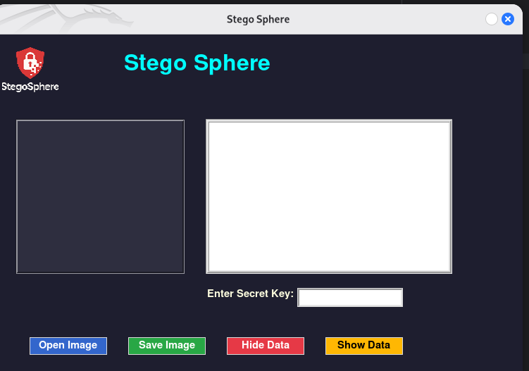
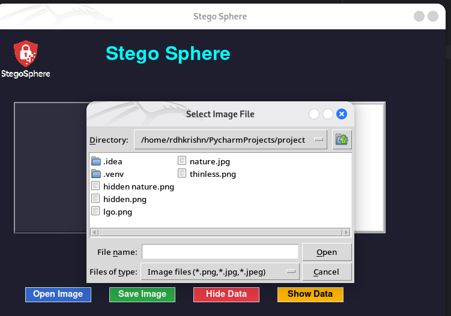
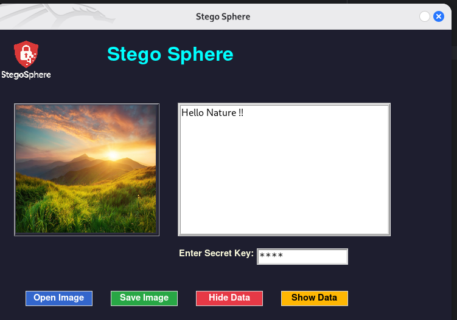
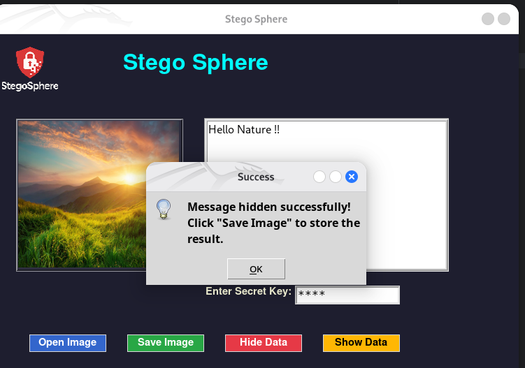

# 🕵️‍♂️ Stegosphere

**Stegosphere** is a simple and effective desktop app that lets you hide and reveal secret messages inside images using LSB steganography. Built with Python and Tkinter.

---

## 📸 Screenshot

## 🖼️ Screenshots

> Interface preview of **Stegosphere** in action:

### 🔍 Main GUI


### 🔐 Message Encoding


### 📂 Message Decoding


### ✅ Output / Confirmation



## 🚀 Features

- Hide secret messages in `.png` or `.jpg` images
- Retrieve hidden messages securely
- Simple GUI built with Tkinter
- Password-protected access (demo: uses key `1234`)
- Save modified image with hidden content

---

## 🔐 How It Works

Stegosphere uses the `stegano` library with the **LSB (Least Significant Bit)** technique to embed messages invisibly into image pixels.

---

## 🛠️ Tech Stack

- Python 3.x
- Tkinter (for GUI)
- Pillow (PIL) for image processing
- Stegano (for hiding/revealing data)

---

## 📋 Requirements

```bash
pip install pillow
pip install stegano

---
## ▶️ Run The App

```bash
python stegosphere.py

---
## 📦 Installation

```bash
git clone https://github.com/cyber-shroud/stego-sphere.git
cd stego-sphere
pip install -r requirements.txt
python stegosphere.py
